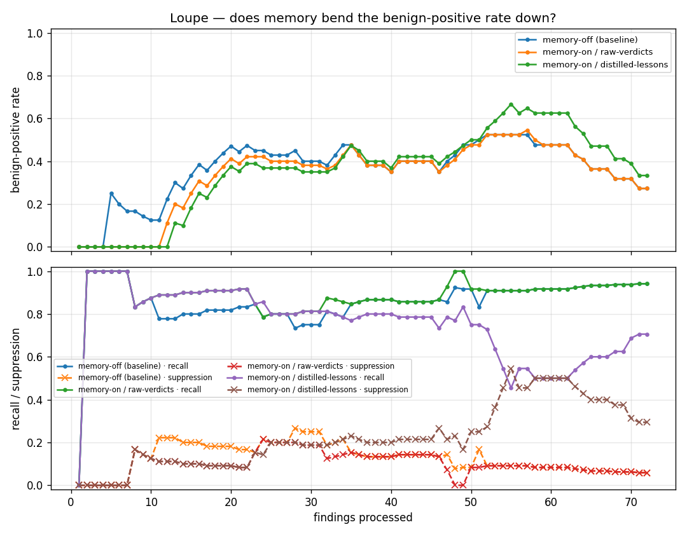

# Loupe

A loupe is the magnifier used to tell a real stone from a fake one — and it's a
homophone for **loop**, the thing being engineered here.

**Question:** does verified-lesson *memory* make a security-finding **validator**
better at separating real vulnerabilities from *benign positives* — findings that
look correct in the code but are neutralized in deployment (upstream auth/mesh,
unreachable routes, sanitization, blocked egress, unmet preconditions)?

This is the pain point from a production pentest agent (PenPal): findings that are
true on paper get surfaced, but the deployed system says otherwise.

## Hypothesis (falsifiable)

> A validator that writes back *verified deployment/exploitability lessons* and
> reuses them achieves a **lower benign-positive rate at equal-or-better recall**
> than the identical validator without memory, and improves as it sees more findings.

The result is a **shape**: the memory arm's benign-positive-rate curve bends down
and separates from a flat no-memory baseline — *while the recall curve stays pinned
at the top*. The joint condition is the pass/fail (you can fake a low bp-rate by
suppressing everything; `suppression_error` is the guardrail that catches it).

## What is frozen vs. varied

The experiment changes exactly **one** thing — the validator — so any delta is
attributable to memory, not to a noisier agent.

```
frozen ──────────────────────┐
analyzer / call-chain (upstream)│→ candidate findings ─┬→ Validator A: no memory   → baseline
                                                       └→ Validator B: + memory    → arm(s)
```

Findings are loaded from disk (cached), so a run is "read file → validate → plot"
and reproduces exactly.

## Loop-engineering knobs (`LoopConfig`)

Each setting is its own curve to overlay — the story is "a *well-engineered loop*
helps, not memory per se":

| knob | values | what it tests |
|------|--------|---------------|
| `memory` | on / off | the headline ablation |
| `distill` | `lesson` / `raw` | does generalizing the outcome beat storing the raw verdict |
| `cadence` | `online` / `batch` | update after each finding vs. after a pass |
| `retrieval` | `exact` / `loose` | precision vs. recall of lesson reuse (over-generalization risk) |

## Run

```bash
pip install -r requirements.txt
cp .env.example .env   # add TOGETHER_API_KEY

# fixture (14 findings — wiring check only)
python eval.py --backend mock                  # offline plumbing demo (not a result)
python eval.py --backend together              # real run on the fixture

# OWASP Benchmark (the real learning curve)
bash scripts/get_owasp.sh                       # sparse/shallow checkout -> ./benchmark
python eval.py --backend together --owasp-dir benchmark \
    --limit 72 --shuffle --window 24 --plot --out results/owasp_curve.csv
# narrow to a few classes to cut cost:  --categories pathtraver,sqli,xss
```

Output: a per-arm summary table + `results/<name>.csv` (long format: arm, i,
bp_rate, recall, suppression_error), and with `--plot` a `<name>.png` of the
overlaid curves.

## Data

- `data/fixture.jsonl` — 14 findings modeled on the real PenPal report, with
  **transfer structure** (multiple findings per root-cause class) and **2 traps**
  (a `/admin/` endpoint and a search-pod SSRF that *are* exploitable despite
  sharing a class with benign siblings). Traps punish lazy over-generalization.
- `loupe/data.py::load_owasp` — maps the **OWASP Benchmark** (~2,700 labeled
  true/false-positive Java cases) into Findings; `class_key` = category so
  findings of the same sink share a class and memory can transfer. This is what
  gives a statistically trustworthy learning curve. `scripts/get_owasp.sh` does a
  sparse/shallow checkout (sources + answer key only). The fixture is only a
  wiring check.

## Sample result (72-case OWASP slice — directional, not conclusive)



In the lower panel both memory arms sit pinned at recall = 1.0 / suppression = 0.0
across the whole run, while the baseline leaks 10–27% of real findings.

| arm | bp_rate | recall | suppression_error |
|-----|--------:|-------:|------------------:|
| memory-off (baseline)         | 0.375 | 0.909 | 0.091 |
| memory-on / raw-verdicts      | **0.353** | **1.000** | **0.000** |
| memory-on / distilled-lessons | 0.371 | **1.000** | **0.000** |

### What the loop-engineering knob bought us

The first version of the distiller wrote *unconditional* rules and **backfired** —
distilled-lessons suppression hit 0.227 (it marked real findings benign because a
class sibling was). Tightening the distiller to emit **conditional, guarded**
rules ("benign ONLY IF control X is present; else exploitable") and making the
validator **apply a lesson only when its precondition holds** fixed it:

| arm | suppression_error before | after |
|-----|--------:|--------:|
| memory-on / distilled-lessons | 0.227 | **0.000** |

That is the whole thesis in miniature: it is not *memory* that helps, it is a
*well-engineered loop* — the same memory with a sloppy distiller is net-harmful.

### Honest caveats

- The benefit here lands mostly on **recall** (memory reinforces confirmed-real
  classes), not on the benign-positive axis — bp_rate moved within noise.
- Temperature-0 is not perfectly deterministic; the baseline drifted ~0.02
  between identical runs. At N=72 (~6 cases/class) bp_rate deltas under ~0.03 are
  not trustworthy. **A real conclusion needs the full ~2,700 cases and multiple
  seeds for error bars.** This is a wiring + direction check.

## Pollution resistance (the memory-safety experiment)

`python experiments/pollution.py` — the worry: a lesson learned from one case is
retrieved for the whole class, so a wrong/over-broad ("poisoned") lesson can
silently suppress a REAL bug that shares the class. We model PenPal's per-decision
**assumptions** on each finding, scope benign lessons to the control they depend
on, and test a defense matrix:

```
defense regime            poison?  corruption  benign_kept
none (auto-apply)             yes 2/2 = 1.00  5/5 = 1.00
write-gate only                no 2/2 = 1.00  5/5 = 1.00
scope only                    yes 2/2 = 1.00  5/5 = 1.00
write-gate + scope             no 0/2 = 0.00  5/5 = 1.00
flag-don't-flip only          yes 0/2 = 0.00  5/5 = 1.00
full defense                   no 0/2 = 0.00  5/5 = 1.00
```

**No single layer suffices** — write-gate stops the poison but the clean lesson
still misfires unscoped; scope alone lets the unconditional poison through.
`write-gate + scope` (or `flag-don't-flip`, which re-grounds from the finding's
own assumptions instead of trusting a lesson's claim) drives corruption to 0
**without** losing the legitimate benign-suppression benefit. The defenses are
drawn from the 2025–2026 agent-memory-safety literature (write-time admission >
retrieval filtering; assumption-scoped retrieval; lesson-flags-don't-flip).

## Honest scope

This validates the **learning mechanism** on labeled findings. It does **not**
reproduce PenPal's real benign-positive rate — public benchmarks lack the
deployment-topology dimension that flips a finding in production. Report the
**delta between arms** (robust to model/training-data contamination), not absolute
precision. A small-N grounded tier (dockerized live targets where the oracle is
*did the exploit actually fire*) is the future fidelity check.

## Design

`docs/SELF-EVOLVING.md` — what self-evolving means for a validator (a governed
loop, not memory accumulation), how PenPal's per-decision assumptions+confidence
log grounds it, the memory-pollution threat + layered defense, and the
2025–2026 literature map.

## Layout

```
loupe/schema.py    Finding / Verdict / Lesson
loupe/prompts.py   validator + distiller prompts (label never shown to validator)
loupe/llm.py       TogetherLLM (real) + MockLLM (offline demo)
loupe/memory.py    SQLite lesson store; predicate-based retrieval
loupe/loop.py      the outer loop = the experiment
loupe/metrics.py   bp_rate / recall / suppression_error + learning curve
eval.py            runner
reference/         the original PenPal report that motivated this
```
